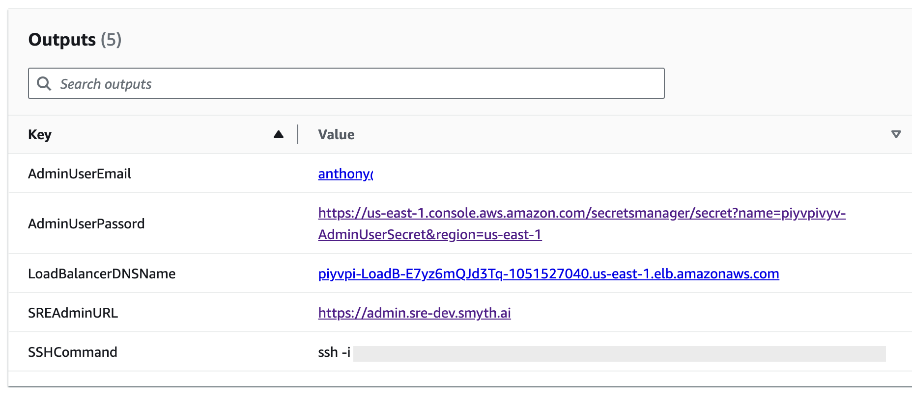
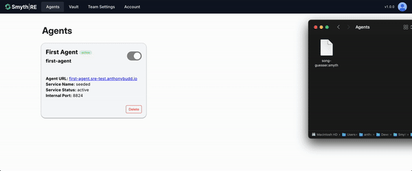

# SmythOS Runtime Environment (SRE) - AWS Getting Started Guide

## Introduction

Welcome to the SmythOS Runtime Environment (SRE) AWS Getting Started Guide. This document will walk you through the initial setup and deployment process for your SmythOS agents.


### CloudFormation Outputs

After deploying SRE from the AWS Marketplace, you'll find essential information in the CloudFormation Stack Outputs tab:



### Accessing the Admin Interface

1. **Admin URL**: Locate the `SREAdminURL` in the CloudFormation outputs.
2. **Credentials**: 
   - Username: The email address provided in the `AdminEmail` parameter
   - Password: Retrieved from the `AdminUserPassword` output

To obtain the plaintext password, navigate to AWS Secrets Manager and access the `AdminUserSecret`.


### Vault and Team Settings

Proper configuration of vault and team settings is crucial for agent execution. Missing configurations may prevent your agent from running.

#### Bulk Upload Team Settings

You can bulk upload team settings using a JSON file in the following format:

```json
{
    "MAX_TOKENS": "8000",
    "IS_DEBUG_MODE": "true"
}
```

### Agent Deployment

1. Navigate to the Agents page in the admin interface.
2. Upload your agent's `.smyth` file.
3. In the upload modal, specify a unique slug for your agent. This slug will form part of the agent's URL.



## Testing Your Agent

The URL structure for accessing your agent is as follows:
```
https://<agent-slug>.<your-subdomain>/api/<endpoint>
```

- `<agent-slug>`: The unique identifier specified during upload
- `<your-subdomain>`: Your SRE instance subdomain
- `<endpoint>`: The specific API endpoint defined in your agent

